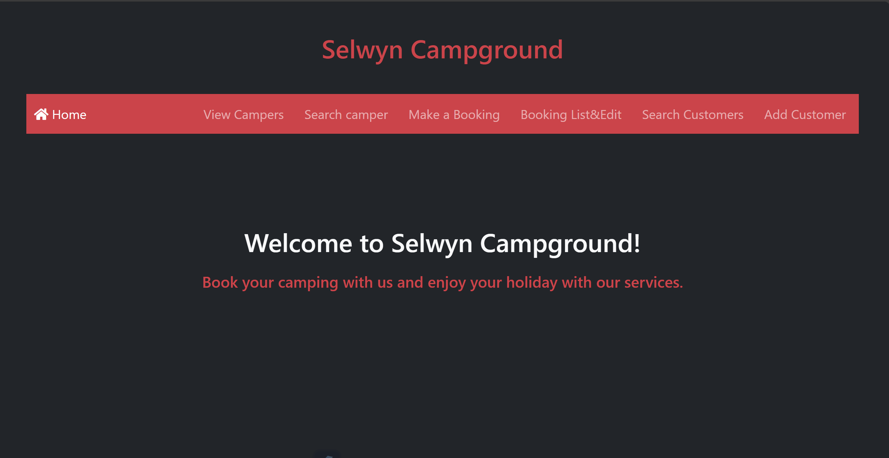

# Sql-Python-Flask
please have a look on my project here: https://suezadeh.pythonanywhere.com/  


## Database questions
## Design decisions

 


**Database questions:**   

**Refer to the supplied scg_local.sql file to answer the following questions:** 
**1- What SQL statement creates the customer table and defines its fields/columns?
   (Copy and paste the relevant lines of SQL.)**      

      ```CREATE TABLE IF NOT EXISTS `customers` (  
  `customer_id` INT NOT NULL AUTO_INCREMENT,  
  `firstname` VARCHAR(45) NULL,  
  `familyname` VARCHAR(60) NOT NULL,  
  `email` VARCHAR(255) NULL,  
  `phone` VARCHAR(12) NULL,  
   PRIMARY KEY (`customer_id`));      
  
  
**2- Which line of SQL code sets up the relationship between the customer and booking tables?**     
    
```CONSTRAINT `customer`  
```FOREIGN KEY (`customer`)  
```REFERENCES `scg`.`customers` (`customer_id`)  
```ON DELETE NO ACTION  
```ON UPDATE NO ACTION);  
  
  **3- Which lines of SQL code insert details into the sites table?**    

    ```INSERT INTO `sites` (`site_id`, `occupancy`) VALUES ('P1', '5');    
   ```INSERT INTO `sites` (`site_id`, `occupancy`) VALUES ('P4', '2');    
   ```NSERT INTO `sites` (`site_id`, `occupancy`) VALUES ('P4', '2');    
   >NSERT INTO `sites` (`site_id`, `occupancy`) VALUES ('P2', '3');  
   >NSERT INTO `sites` (`site_id`, `occupancy`) VALUES ('P2', '3');  
   >NSERT INTO `sites` (`site_id`, `occupancy`) VALUES ('P5', '8');  
   >NSERT INTO `sites` (`site_id`, `occupancy`) VALUES ('P5', '8');  
   >NSERT INTO `sites` (`site_id`, `occupancy`) VALUES ('P3', '2');  
   >NSERT INTO `sites` (`site_id`, `occupancy`) VALUES ('P3', '2');  
   >NSERT INTO `sites` (`site_id`, `occupancy`) VALUES ('U1', '6');  
   >NSERT INTO `sites` (`site_id`, `occupancy`) VALUES ('U2', '2');  
   >NSERT INTO `sites` (`site_id`, `occupancy`) VALUES ('U3', '4');  
   >NSERT INTO `sites` (`site_id`, `occupancy`) VALUES ('U4', '4');  
   >NSERT INTO `sites` (`site_id`, `occupancy`) VALUES ('U5', '2');  
   >NSERT INTO `customers` (`customer_id`, `firstname`, `familyname`, `email`, >phone`)     VALUES ('563', 'Simon', 'Smith', 'simon@smith.nz', '0244881901');  
   >NSERT INTO `customers` (`customer_id`, `firstname`, `familyname`, `email`, >phone`)   VALUES ('241', 'Jasmine', 'Holiday', 'jaz@onholiday.co.nz', >0274823801');
   >NSERT INTO `customers` (`customer_id`, `firstname`, `familyname`, `email`, >phone`)   VALUES ('1654', 'Jonty', 'Jensen', 'Jonty_Jensen@gmail.com', >041208776');  
   >NSERT INTO `customers` (`customer_id`, `firstname`, `familyname`, `email`, >phone`)   VALUES ('1655', 'Kate', 'McArthur', 'K_McArthur94@gmail.com', >0281953665');  
   >NSERT INTO `customers` (`customer_id`, `firstname`, `familyname`, `email`, >phone`)   VALUES ('1656', 'Jack', 'Hopere', 'Jack643@gmail.com', '0224972003');  
   >NSERT INTO `customers` (`customer_id`, `firstname`, `familyname`, `email`, >phone`)     VALUES ('1657', 'Chloe', 'Mathewson', 'Chloe572@gmail.com', >0236621370');    
   >NSERT INTO `customers` (`customer_id`, `firstname`, `familyname`, `email`, >phone`)    VALUES ('1658', 'Kate', 'McLeod', 'KMcLeod112@gmail.com', >0275578364');  
   >NSERT INTO `customers` (`customer_id`, `firstname`, `familyname`, `email`, >phone`)   VALUES ('1659', 'Sam', 'Dawson', 'SamDawson@gmail.com', '071721045');  
   >NSERT INTO `customers` (`customer_id`, `firstname`, `familyname`, `email`, >phone`)   VALUES ('1660', 'Heidi', 'Delaney', 'HDelaney@gmail.com', >0282942819');  
   >NSERT INTO `customers` (`customer_id`, `firstname`, `familyname`, `email`, >phone`)   VALUES ('1661', 'Michael', 'Wright', 'Michael_Wright@gmail.com', >037512653');  
   >NSERT INTO `customers` (`customer_id`, `firstname`, `familyname`, `email`, >phone`)   VALUES ('1662', 'Elizabeth', 'Preston', 'ElizabethPreston@gmail.com', >094255377');  
   >NSERT INTO `bookings` (`booking_id`, `site`, `customer`, `booking_date`,>occupancy`)   VALUES ('346', 'P1', '1659', '2024-05-12','2');   
   >NSERT INTO `bookings` (`booking_id`, `site`, `customer`, `booking_date`,>occupancy`)     VALUES ('347', 'P1', '1659', '2024-05-13','2');  
   >NSERT INTO `bookings` (`booking_id`, `site`, `customer`, `booking_date`,>occupancy`)   VALUES ('348', 'P1', '1659', '2024-05-14','2');   
   >NSERT INTO `bookings` (`booking_id`, `site`, `customer`, `booking_date`,>occupancy`)    VALUES ('231', 'P5', '563', '2024-06-01','7');   
   >NSERT INTO `bookings` (`booking_id`, `site`, `customer`, `booking_date`,>occupancy`)    VALUES ('232', 'P5', '563', '2024-06-02','7');  
   >NSERT INTO `bookings` (`booking_id`, `site`, `customer`, `booking_date`,>occupancy`)  VALUES ('233', 'P5', '563', '2024-06-03','7');  
   >NSERT INTO `bookings` (`booking_id`, `site`, `customer`, `booking_date`,>occupancy`) VALUES ('234', 'P5', '563', '2024-06-04','7');  
   >NSERT INTO `bookings` (`booking_id`, `site`, `customer`, `booking_date`,>occupancy`) VALUES ('235', 'U2', '241', '2024-06-02','2');    
   >NSERT INTO `bookings` (`booking_id`, `site`, `customer`, `booking_date`,>occupancy`)   VALUES ('236', 'U2', '241', '2024-06-05','2');  
   >NSERT INTO `bookings` (`booking_id`, `site`, `customer`, `booking_date`,>occupancy`)     VALUES ('237', 'U2', '241', '2024-07-05','2');  
   >NSERT INTO `bookings` (`booking_id`, `site`, `customer`, `booking_date`,>occupancy`)     VALUES ('238', 'U2', '241', '2024-07-06','2'); 
         
**4- Suppose that as part of an audit trail, the time and date a booking was added to the database needed to be recorded. What fields/columns would you need to add to which tables? Provide the table name, new column name and the data type. (Do not implement this change in your app.)**   

> •	table name: Bookings    
> •	new column name: created_at    
> •	data type: datetime or TimeStamp         
	
**5- Suppose the ability for customers to make their own bookings was added. Describe two different changes that would be needed to the data model to implement this.**  
   (Do not implement these changes in your app.)         

> • Adding a user authentication system: This usually involves creating a new table >such as users with fields user_id, username, password_hash, ..... Each client can be >linked to a user to be able having a secure login.  
>
> • Modify the reservations table to include a status field: this will track the >status of each reservation (for example pending, confirmed, canceled). It helps >manage bookings to be done directly by customers, including changes or >cancellations.        
	
=================================================================

**Design decisions**

When designing and developing the app, I made several key design decisions to ensure functionality and enhance user experience. Here's a summary of these choices:    

*User interface design:*    
I chose a red color theme based on insights presented in the Comp 640 class about the impact of the red color on UX. Through that presentation I learnt about other colors impact on UX too. The vibrant red color has been chosen to attract and engage users and provides an energetic feel to the app.    

*Navbar and layout:*      
The layout and navigation structure of the app was heavily influenced by what I learned in the UX Design course (COM640). My goal was simplicity and intuitive design to make the app user-friendly. I researched several other sites for layout inspiration and made sure our app navigation was logical and efficient. Built with Bootstrap, the navigation bar is a vital component that provides easy access to all parts of the app for users.    

*Form Management and Page Navigation:*  
In designing the app, I chose to dedicate specific pages to display form data after submission. This decision was driven by the principles of interaction design, specially visibility of system status, user control and freedom which are two of the ten key principles. By doing this, I aimed to give users a clear view and control over the data they submitted, enhancing their ability to manage their inputs effectively.   

*Technical decisions*    
Data management: At first I had problems with MySQL because I forgot my password. I solved this problem using a special command lines tool I found on Google.      
Troubleshooting: I tried to fix an issue where client searches were returning empty results by googling the error and find some coded to make connection better with mysql. one of the best website for error handling that i used was stack over flow.       

*Data Management:*  
Initially, I encountered a hiccup with MySQL; I had forgotten my password, which halted my progress. Fortunately, I resolved this issue by using a command-line tool that I found through a Google search. This tool allowed me to reset the password and regain access to my database, ensuring that data management could proceed without further issues.    

*Troubleshooting:*  
I faced a challenge when client searches were returning empty results, which was critical to address to ensure functionality. To tackle this, I searched for the specific error messages on Google and found useful code snippets and troubleshooting advice. I frequently consulted Stack Overflow, a resource that proved invaluable for finding solutions and bettering my SQL connection queries. This approach not only fixed the immediate problem but also enhanced my understanding of database handling and error resolution.     

*Using GET and POST:*  
I used both GET and POST in my project. I used GET to pull data from the MySQL database when I needed to look up campers or search for customers. It's good because it keeps things simple and the data can be seen right in the URL.    

For adding new customers or making bookings, I chose POST because it's more secure. It hides the data away from the URL, which is important for private information.    

Learning to use @app.route for both GET and POST was a cool challenge. It helped me understand more about how web apps work.  
